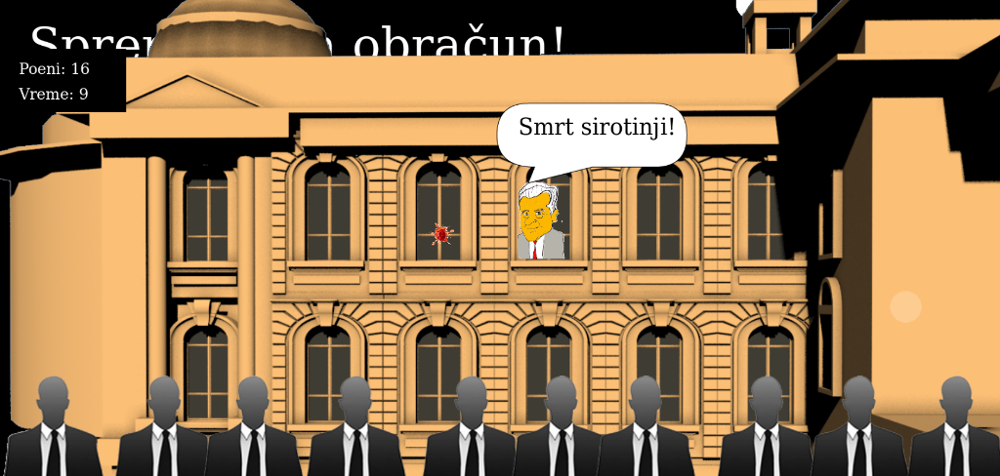

# Igrica političari (*Parliament Siege*)

Političari izlaze na prozor skupštine, i ti ih gađaš paradajzom. To je sve.

Možeš je isprobati ovde: [mudroljub.github.io/igrica-politicari/](http://mudroljub.github.io/igrica-politicari/)

Status: nezavršeno.

## Instalacija

Nema nikakve posebne instalacije, možeš prekopirati projekat i otvoriti `index.html` u browseru.

## URADITI

* ubaciti sirinu i visinu ekrana medju parametre, da se ne uzima window.innerHeight tokom igre
	* prvo mora da ucita pozadinu da bi prilagodio
* da crtabalon posle paradajza
// parola da skida energiju
// bacaParolu malo nakon izlaska, a nekad ne baca
// politicar izadje, malo odstoji, pa ode
* da crta balon posle paradajza, kao masu
* menjanje oruzja
* uvodna animacija uvecavanje skupstina
* prikazati najbolji rezultat u tabeli (napraviti upisivanje)
* prilagodiPozadinu, uzeti u obzir sire i tanje ekrane
* izdvojiti klasu Politicar
* prilagoditi tablu s poenima

## PROBLEMI

* parole se preklapaju jer izadje po jedna za svakog politicara
* prvi paradajz ne treba da puca
* da crtaProjektilNaLiku ne napusta prozor, a crtaParadajzOkolo ne ulazu u zauzet prozor
* kad je presirok ekran, sece pozadinu po visini !

## DOBRE PRAKSE

* zaokruziti crtanje na pun piksel, bez decimala

## Licenca

Igrica je otvorenog koda. Dozvoljeno je slobodno igranje, prepravljanje i kopiranje.

Autori zadržavaju isključivo pravo na komercijalizaciju dela.
